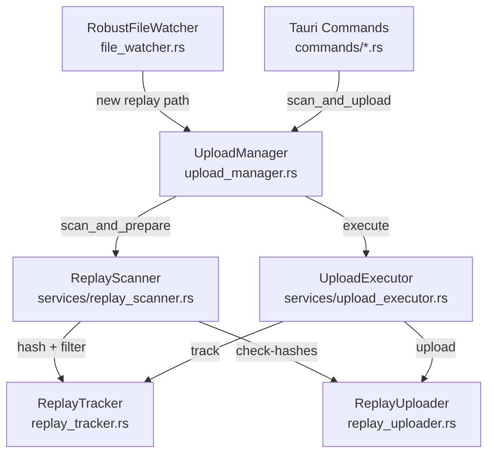

# Ladder Legends Uploader

A Rust/Tauri v2 desktop app that watches SC2 replay folders and uploads new replays to Ladder Legends Academy.

## Architecture



**Layers:**

| Layer | Files | Responsibility |
|---|---|---|
| Presentation | `src-tauri/src/commands/*.rs` | Tauri commands, event emission |
| Application | `upload_manager.rs`, `services/upload_executor.rs` | Orchestration |
| Service | `replay_parser.rs`, `services/replay_scanner.rs` | Business logic |
| Repository | `replay_uploader.rs`, `replay_tracker.rs` | API calls, file I/O |

## Key Modules

- **`upload_manager.rs`** — Central orchestrator. Owns `scan_semaphore` (single-flight), `rescan_needed` flag, `CancellationToken`, and `in_flight_hashes`.
- **`file_watcher.rs`** — `RobustFileWatcher` wraps the `notify` crate with heartbeat monitoring, polling fallback, and Windows buffer-overflow recovery.
- **`device_auth.rs`** — `ApiClient` for device code flow (request → poll → verify). No token storage — that lives in `commands/tokens.rs`.
- **`commands/tokens.rs`** — OS keychain storage (macOS Keychain / Windows Credential Manager / Linux Secret Service) with auto-migration from legacy `auth.json`.
- **`config_utils.rs`** — `atomic_write_json()`: write to `.tmp` → fsync → rename.
- **`errors.rs`** — `UploaderError` enum. 401 responses propagate as the sentinel string `"auth_expired"`.
- **`api_contracts.rs`** / **`api_contracts/`** — Shared request/response types for API contract tests.

## Build Commands

```bash
# Development
cargo build
cargo test

# Frontend
npm install
npm run build

# Full Tauri dev
npm run tauri dev

# Release bundle
./build-release.sh
```

## Data Directory

macOS: `~/Library/Application Support/ladder-legends-uploader/`
Linux: `~/.config/ladder-legends-uploader/`
Windows: `C:\Users\<User>\AppData\Roaming\ladder-legends-uploader\`

Key files:
- `replays.json` — local replay tracker (not sqlite)
- `auth.json` — legacy token file (migrated to keychain on first load)
