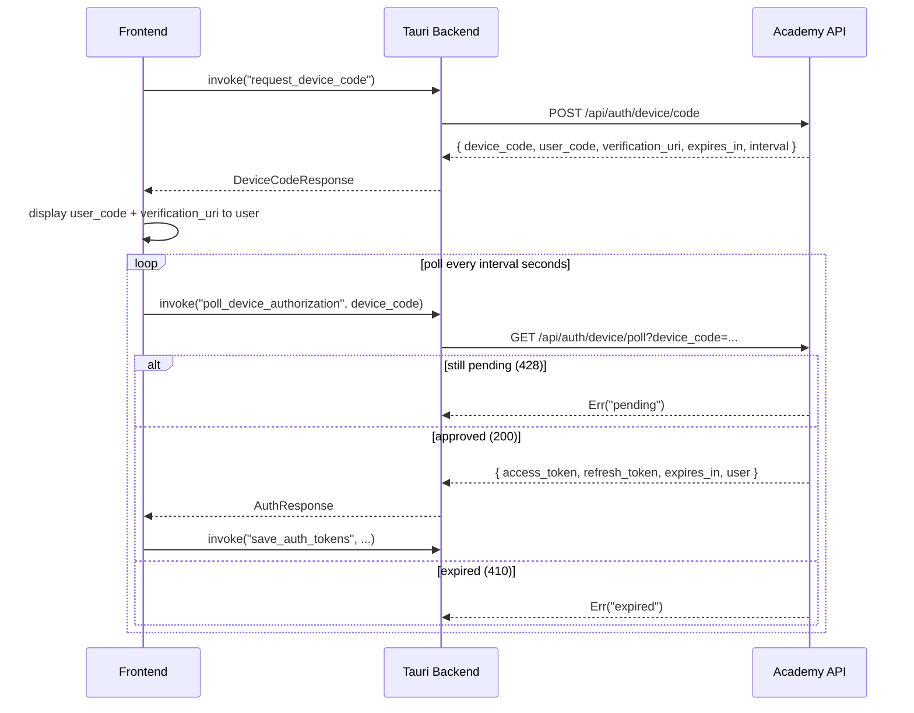
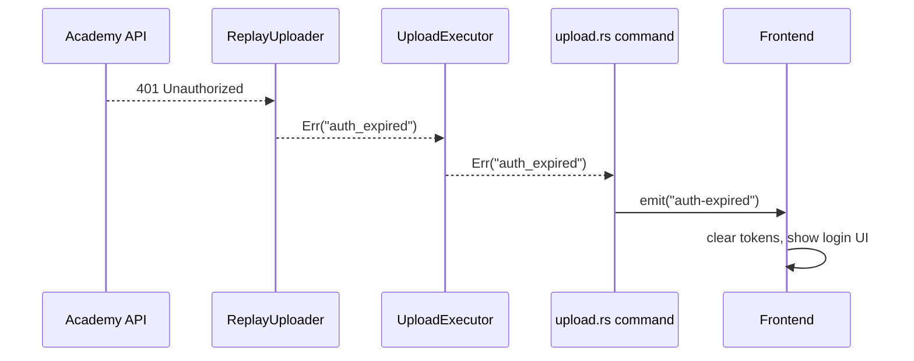

# Authentication Flow

## Device Code Flow

## Token Storage (`commands/tokens.rs`)

Tokens are stored in the OS keychain:
- macOS: Keychain (service `ladder-legends-uploader`, account `auth_tokens`)
- Windows: Credential Manager
- Linux: Secret Service

**Auto-migration**: On first `load_auth_tokens` call, if a legacy `auth.json` plaintext file exists in the config directory, it is read, stored in the keychain, and deleted.

**File fallback**: If the keychain is unavailable, tokens fall back to `auth.json` in the config directory.

## Token Verification on Launch

On app launch, the frontend calls `invoke("verify_auth_token")` which hits `POST /api/auth/device/verify`. If the token is invalid, the frontend starts the device code flow.

## 401 Detection and Re-Auth

Any API call in `replay_uploader.rs` that receives a 401 response returns `Err("auth_expired")`. This string propagates up through `UploadExecutor` → `UploadManager` → `commands/upload.rs`, which emits the Tauri event `auth-expired` to the frontend. The frontend then clears stored tokens and restarts the device auth flow.

## Token Refresh

When `refresh_token` is present and `expires_at` is approaching, the frontend can call `POST /api/auth/device/refresh` directly. The backend does not auto-refresh — refresh is frontend-driven via `invoke("save_auth_tokens")` after receiving new tokens.
