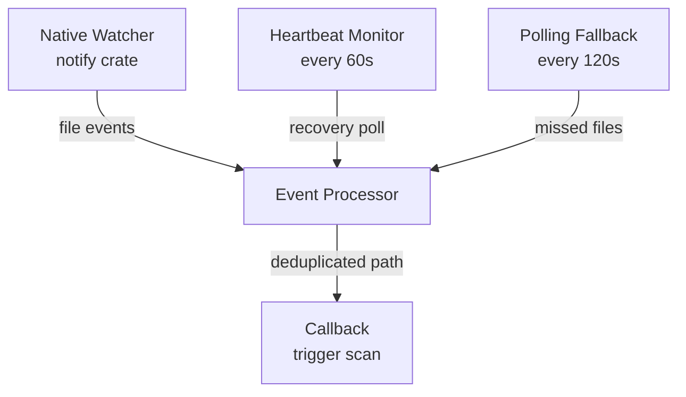

# File Watcher

## Overview

`RobustFileWatcher` in `src-tauri/src/file_watcher.rs` wraps the `notify` crate with reliability features for Windows and handles missed events via periodic polling.

## Architecture

Three async tasks run concurrently after `start()`:

1. **Native watcher** — OS-level file events via `notify::recommended_watcher`. Runs in a dedicated thread (notify requires sync context) and forwards events to an async channel.
2. **Heartbeat monitor** — checks every 60 seconds whether any events have been received in the last 300 seconds. If not, triggers a recovery poll scan. Resets the last-event timestamp after recovery.
3. **Polling fallback** — scans all configured folders every 120 seconds. Only sends new `.SC2Replay` files modified within the last poll interval + 30 seconds.

## Shutdown

`stop()` sets `is_running = false` and drops the shutdown sender, which unblocks the native watcher OS thread's `recv()` call, cleanly dropping the `notify::Watcher`.

The `UploadManager` owns a `CancellationToken` (from `tokio_util`) that signals background scan tasks to exit early. These are separate from the file watcher's own `is_running` flag.

## Deduplication

`processed_files: HashSet<PathBuf>` is shared across all three event sources. The event processor checks this set before invoking the callback — so the same file can't be processed twice regardless of which source detected it.

## Platform Differences

| Setting | macOS/Linux | Windows |
|---|---|---|
| `file_processing_delay_ms` | 500ms | 1000ms |

Windows needs more time due to antivirus scanning and file locking after a replay is written.

## Windows Buffer Overflow

On Windows, `ReadDirectoryChangesW` can overflow its internal buffer under heavy file activity, producing `RescanNeeded` errors from `notify`. The watcher logs these and relies on the polling fallback to catch any missed replays.

## Configuration

`WatcherConfig` (with `Default` impl):

| Field | Default | Description |
|---|---|---|
| `heartbeat_interval_secs` | 60 | How often to check watcher health |
| `heartbeat_timeout_secs` | 300 | Max seconds without events before recovery |
| `poll_interval_secs` | 120 | Polling fallback interval |
| `file_processing_delay_ms` | 500/1000 | Wait before processing a new file |
