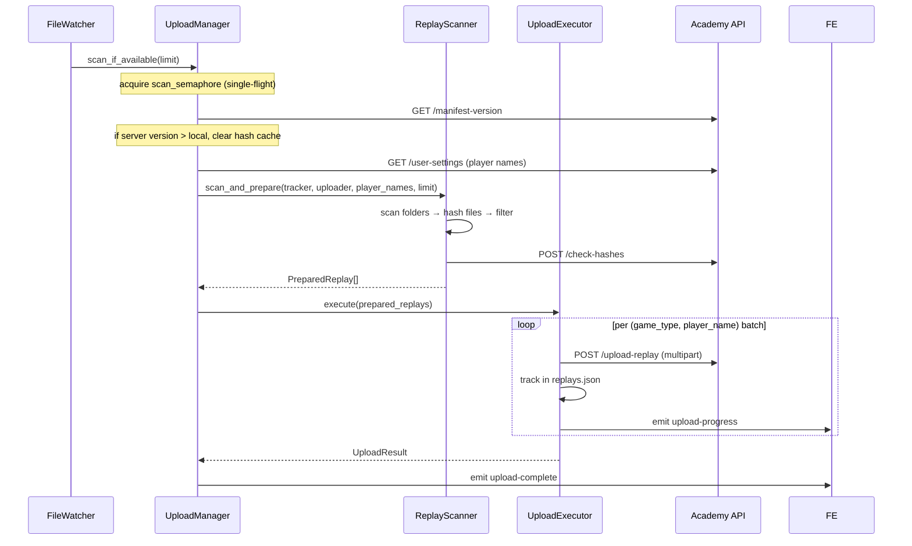

# Upload Pipeline

## Flow

## Steps in Detail

### 1. Scan trigger

`scan_if_available()` in `upload_manager.rs` uses a `Semaphore(1)` to ensure only one scan runs at a time. If a scan is already running when a new replay is detected, `rescan_needed` is set to `true`. The running scan will loop and re-scan once it finishes.

### 2. Manifest version sync

Before scanning, `check_and_sync_manifest_version()` fetches `GET /api/manifest-version` (edge-cached, 24h TTL). If the server version (ISO timestamp string) is greater than the local cached version, the local hash cache is cleared — forcing a full re-sync with `check-hashes`.

### 3. Scan and prepare (`services/replay_scanner.rs`)

`ReplayScanner::scan_and_prepare()`:
1. Walk all configured replay folders recursively
2. Filter: keep only competitive game types where a known player name appears
3. Skip replays already tracked locally (`replays.json`)
4. Compute SHA-256 hash for each candidate file
5. Send batch to `POST /api/my-replays/check-hashes` — API returns which hashes are already stored server-side
6. Return `PreparedReplay[]` for the ones not yet on the server

### 4. Batch grouping

Replays are grouped by `(game_type, player_name)` using `group_replays_by_type_and_player()` in `upload_manager.rs`. Groups are sorted for consistent ordering.

### 5. Upload execution (`services/upload_executor.rs`)

`UploadExecutor::execute()` iterates batches. Per replay:
- `POST /api/my-replays` (multipart form: file + metadata)
- On success: mark as tracked in `replays.json` via `ReplayTracker`
- On 401: propagate `"auth_expired"` sentinel → caller emits `auth-expired` Tauri event
- On other error: log and continue (single file failure doesn't abort the batch)

### 6. Events emitted

| Event | Payload |
|---|---|
| `upload-start` | `{ limit }` |
| `upload-checking` | `{ count }` |
| `upload-check-complete` | `{ new_count, existing_count }` |
| `upload-batch-start` | `{ game_type, player_name, count }` |
| `upload-progress` | `{ filename, status }` |
| `upload-batch-complete` | `{ game_type, player_name, uploaded }` |
| `upload-complete` | `{ count }` |
| `auth-expired` | (none) |

## Error Handling

- **401 from API** → returns `Err("auth_expired")` → `upload.rs` command catches `e.contains("auth_expired")` → emits `auth-expired` Tauri event
- **Network errors** → logged, file skipped, batch continues
- **Parse errors** → logged, file skipped
- **Cancelled** (`CancellationToken`)  → `scan_and_upload` and `scan_if_available` check at each checkpoint and return `Ok(0)` early
